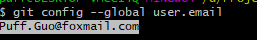
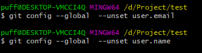
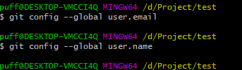
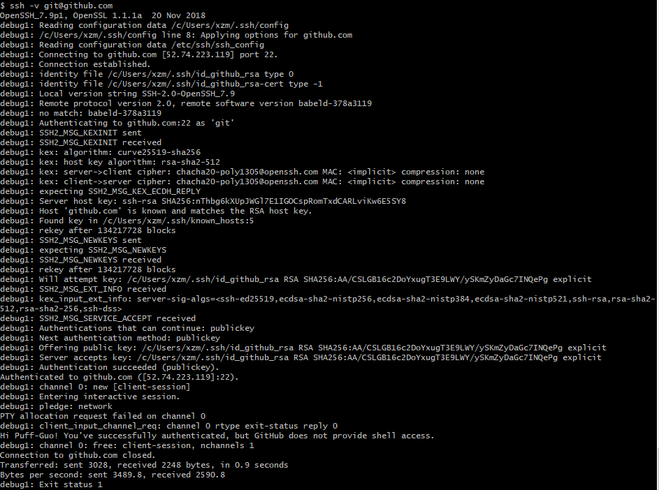

# git多账号设置
1. 检查是否有全局账号设置
    ```git config --global user.email```
        
    ```git config --gloal user.name```
        

    如果存在全局用户/email需要先删除
        

    检查是否删除
        


2. 生成相应的ssh_key,参考前面章节

3. 创建配置文件 .ssh/config
    ```
    #Add work user(puff.guo@xxx.com.cn)
    Host gitlab.yunpiaoer.com
    HostName gitlab.xxx.com
    User puff
    IdentityFile ~/.ssh/id_rsa
    ##############################################
    #default github user(Puff.Guo@foxmail.com)
    Host github.com
    HostName github.com
    User puff
    IdentityFile ~/.ssh/id_github_rsa
    ```

4. 验证
    ```ssh -T git@github.com```
    ```ssh -v git@github.com``` 查看查找ssh key 过程,如下:
        

5. 总结
    如果以上步骤都完成,则可以同时拉取多个不同地址的仓库,但是在推送时,需要现在每个仓库设置本地用户和邮件才能推送.