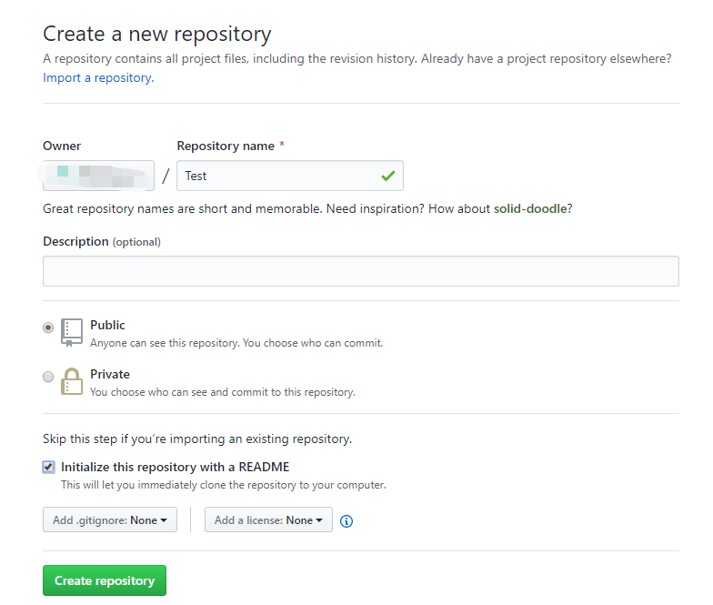
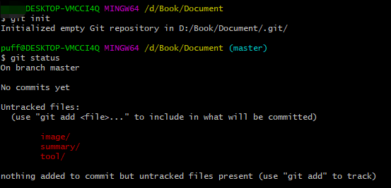
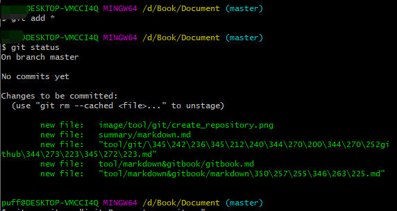
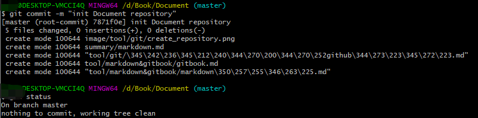
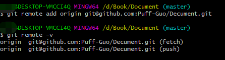
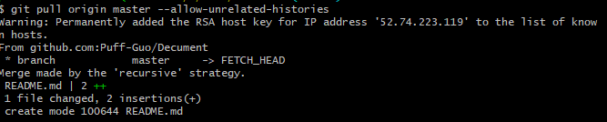
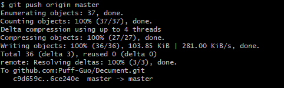

# 创建git仓库

## 目标

把本地的资源推送到github,在互联网上与人分享，共同学习。

## 过程
1. 在github创建一个空的仓库

    在github创建一个仓库，记录仓库地址

    

2. 初始化本地仓库

    到要分分享资源目录，```git init``` 初始化仓库

    

3. 添加上传资源

    查看当前仓库目录资源，添加并提交内容到仓库

    

    

1. 添加远程仓库地址

    ```git remote add origin git@github.com:Puff-Guo/Decument.git```,命令添加远程仓库地址。
    

5. 拉取远程仓库到本地

    ```git pull origin master```,如果出现fatal: refusing to merge unrelated histories错误，则加上--allow-unrelated-histories,允许合并不相关的历史，这是由于目前本地仓库和远程仓库不是同一个仓库。

    

6. 推送资源到远程仓库
    
    ```git push origin master``` 命令，推送资源到远程仓库。

    

## 总结
        以上就是创建git仓库的全部内容。
